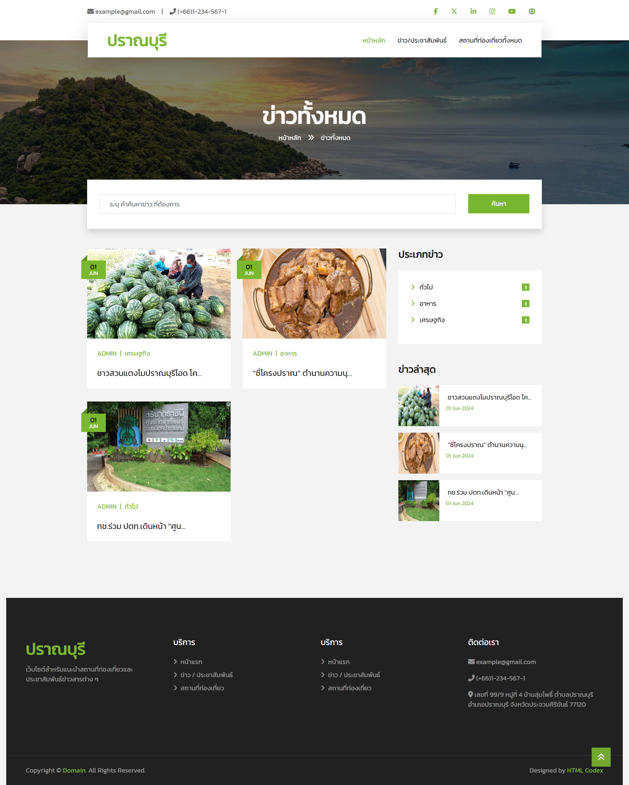
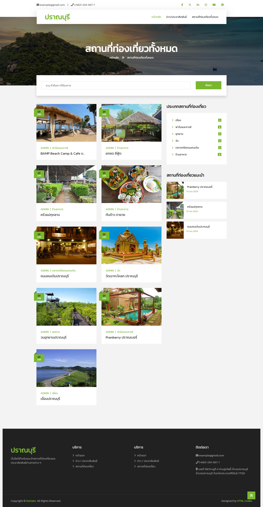
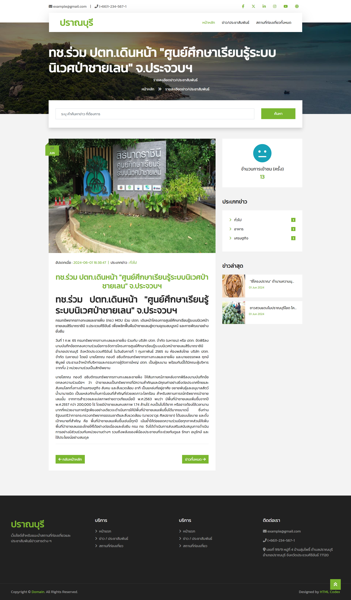
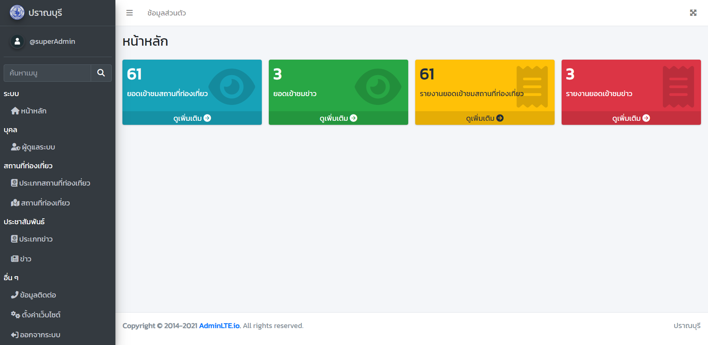
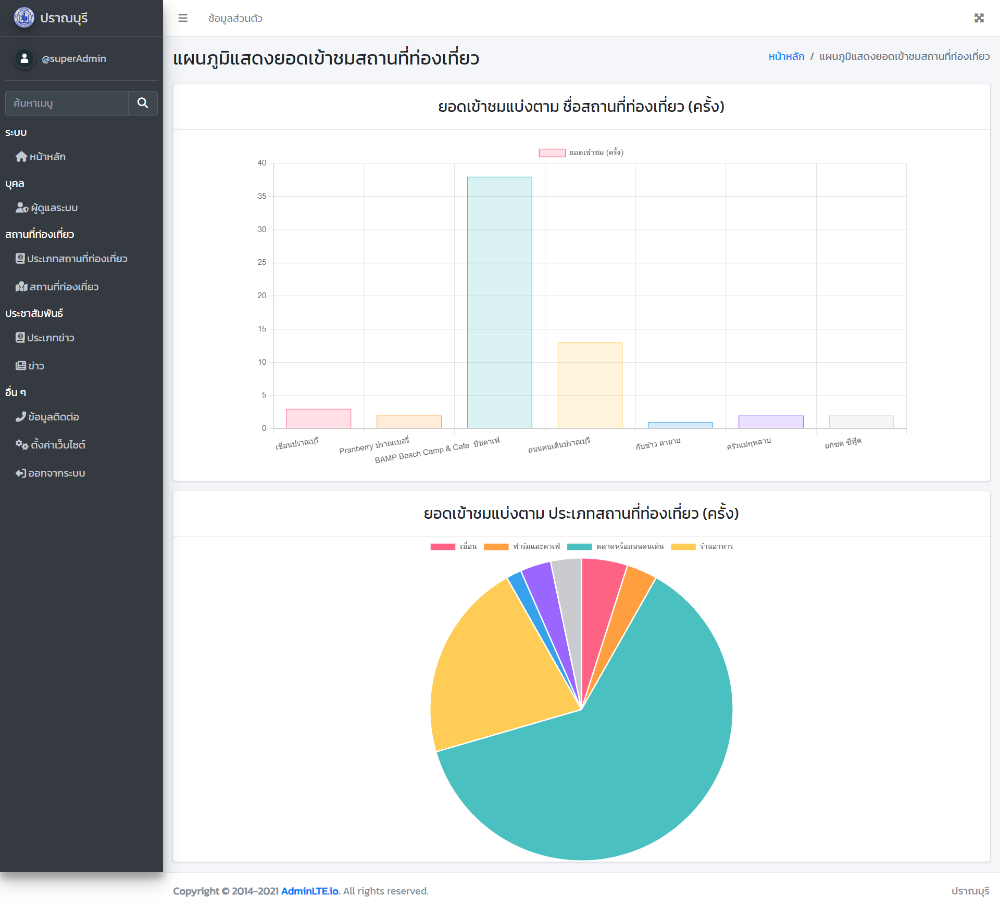
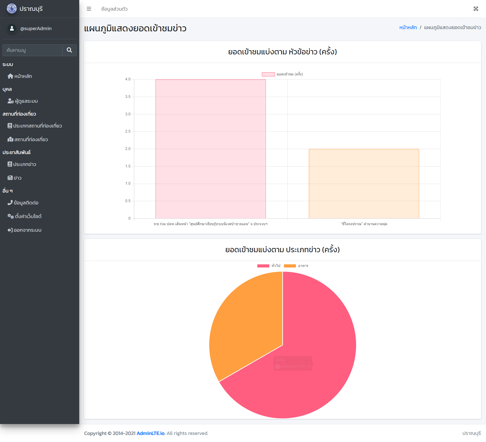
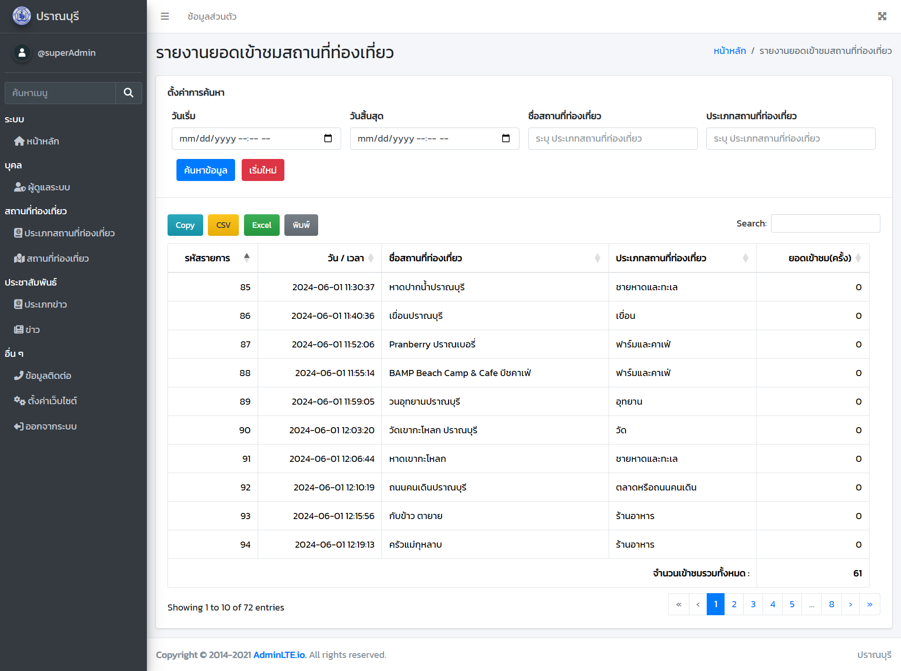
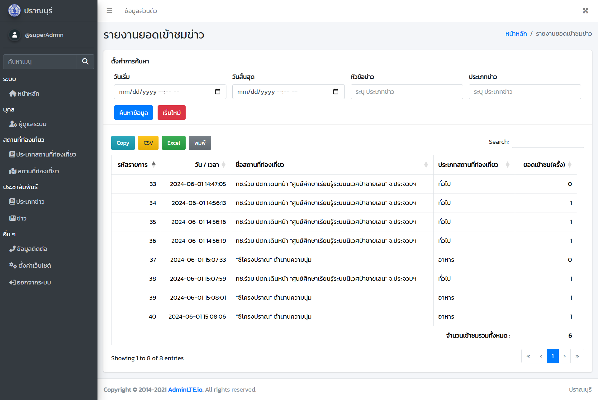

### 📖 Project Website Pran Buri Travel (เว็บไซต์แนะนำสถานที่ท่องเที่ยวในอำเภอปราณบุรี)

###### ✍️แก้ไขเมื่อ : 29/10/2566

###### 👨‍💻ผู้จัดทำ : Adisak

---

เป็นโปรเจ็คที่ทำขึ้นในการเรียนวิชา วิศวกรรมซอฟต์แวร์ (Software Engineering) (ITD 2209 - 65) โดยได้ลงพื้นที่เพื่อรวบรวมปัญหา และขอคำแนะนำจากชาวบ้านในพื้นที่ อำเภอปราณบุรี จังหวัดประจวบคีรีขันธ์ เพื่อพัฒนาเว็บไซต์ตามความต้องการของผู้ใช้งาน สามารถดูตัวอย่างเว็บไซต์ได้ [ที่นี่](https://github.com/Adisak-KS/Project-Website-Travel-Pranburi/tree/main/previews) หรือดูรายงานได้ [ที่นี่](previews/04_document/การพัฒนาเว็บไซต์แนะนำสถานที่ท่องเที่ยวตำบลปากน้ำปราณ.pdf)

---

### ⭐ ระบบภายในเว็บไซต์

        1. 👮ผู้ใช้ระดับผู้ดูแลระบบ (Admin)
            ✅ สามารถ login เข้าสู่ระบบได้
            ✅ สามารถแก้ไขข้อมูลส่วนตัวได้
            ✅ สามารถแก้ไขข้อมูลบัญชี เช่น Username และ Email ตนเองได้
            ✅ สามารถแก้ไข Password ตนเองได้
            ✅ สามารถ เพิ่ม แก้ไข ลบ ข้อมูลผู้ดูแลระบบได้ (ลบ Admin ได้เฉพาะ Admin ที่มี adm_id = 1)
            ✅ สามารถ เพิ่ม แก้ไข ลบ ข้อมูลประเภทสถานที่ท่องเที่ยวได้
            ✅ สามารถ เพิ่ม แก้ไข ลบ ข้อมูลสถานที่ท่องเที่ยวได้
            ✅ สามารถ เพิ่ม แก้ไข ลบ ข้อมูลประเภทข่าวได้
            ✅ สามารถ เพิ่ม แก้ไข ลบ ข้อมูลข่าวได้
            ✅ สามารถ แก้ไข ข้อมูลช่องทางติดต่อได้
            ✅ สามารถ แก้ไข การตั้งค่าเว็บไซต์ได้
            ✅ สามารถ ตรวจสอบยอดเข้าชมสถานที่ท่องเที่ยว ในรูปแบบ graph ได้
            ✅ สามารถ ตรวจสอบยอดเข้าชมข่าว ในรูปแบบ graph ได้
            ✅ สามารถ Export รายงานยอดเข้าชมสถานที่ท่องเที่ยว ในรูปแบบ copy, csv, excel, print ตามช่วงเวลา, ชื่อสถานที่ท่องเที่ยว, ประเภทสถานที่ท่องเที่ยวได้
            ✅ สามารถ Export รายงานยอดเข้าชมข่าว ในรูปแบบ copy, csv, excel, print ตามช่วงเวลา, หัวข้อข่าว, ประเภทข่าวได้
            ✅ สามารถ Logout ออกจากระบบได้

        2. 👥ผู้ใช้ระดับทั่วไป (User)
            ✅ สามารถเลือกดูสถานที่ท่องเที่ยวได้
            ✅ สามารถค้นหาสถานที่ท่องเที่ยวด้
            ✅ สามารถเลือกดูข่าวได้
            ✅ สามารถค้นหาข่าวได้

        3. 🪂ระบบอื่น ๆ (Other)
             ✅ ตรวจสอบข้อมูลใน Form ก่อนทำใน Database
             ✅ ตรวจข้อมูลซ้ำ เช่น Username, Email, ประเภท, ชื่อ เป็นต้น
             ✅ มีรูป Default เมื่อเพิ่มข้อมูลใหม่
             ✅ เมื่อมีการ แก้ไข ลบ รูปภาพใหม่ รูปภาพเดิมในโฟเดอร์ uploads จะถูกลบด้วย
             ✅ มี Confirm ให้ผู้ใช้ยืนยันก่อนลบข้อมูลใน Database
             ✅ เมื่อมีการ เพิ่ม แก้ไข ลบข้อมูล สำเร็จ/ไม่สำเร็จ จะมี Sweetalert2 เพื่อแจ้งให้ผู้ใช้ได้ทราบ
             ✅ มีผู้ใช้งานระดับผู้ดูแลระบบ (Admin) เริ่มต้น จำนวน 2 บัญชี (ไม่สามารถลบได้)

---

### ✍️ ภาษาที่ใช้ในการพัฒนาระบบ

        1. HTML
        2. CSS
        3. JavaScript
        4. Bootstrap5
        5. PHP (PDO)
        6. MySQL
        7. Sweetalert2
        8. jQuery Validation Plugin
        9. Chart.js
        10. DataTables
        11. CKEditor 5

---

### 🛠️ เครื่องมือที่ใช้

        1. Visual Studio Code
        2. XAMPP

---

### 📥วิธีติดตั้งเว็บไซต์

    1. นำ Database ในโฟลเดอร์ db/pranburi.sql ไปติดตั้งใน XAMPP
    2. นำ โฟลเดอร์งาน ไปวางไว้ภายในเครื่องตนเอง
    3. หากมี Error เกี่ยวกับ Database ให้ตรวจสอบที่ db/connect.php ที่ username หรือ password

---

### 🕯️วิธีเข้าใช้งาน

    1. เข้าใช้งานระดับสมาชิก(Member) โดยสมัครสมาชิกที่ http://localhost/travel/
    2. เข้าใช้งานระดับผู้ดูแลระบบ (Admin) โดยเข้าที่ http://localhost/travel/adminLTE/login_form.php (ต้องเข้าผ่าน Admin เริ่มต้น)

---

### 📑ข้อมูลผู้ดูแลระบบ (Admin) เริ่มต้น

    1. Admin (Super Admin) ที่มีสิทธิ์ลบ Admin อื่น ๆ
            Username : superAdmin
            Password : superAdmin1

    2. Admin (Default)
            Username : admin111
            Password : admin111

---

### 💻 ตัวอย่างเว็บไซต์
**ของผู้ใช้ทั่วไป(User)**

1. หน้าแรกของเว็บไซต์
   

2. หน้าข่าวทั้งหมด

3. หน้าสถานที่ท่องเที่ยวทั้งหมด

4. หน้าแสดงรายละเอียดข่าว

5. หน้าแสดงรายละเอียดสถานที่ท่องเที่ยว

---

**ของผู้ดูแลระบบ (Admin)**

1. หน้าแรกของผู้ดูแลระบบ

3. หน้าแสดง graph ยอดเข้าชมสถานที่ท่องเที่ยว

4.  หน้าแสดง graph ยอดเข้าชมข่าว

5. หน้ารายงาน ยอดเข้าชมสถานที่ท่องเที่ยว

5. หน้ารายงาน ยอดเข้าชมข่าว

